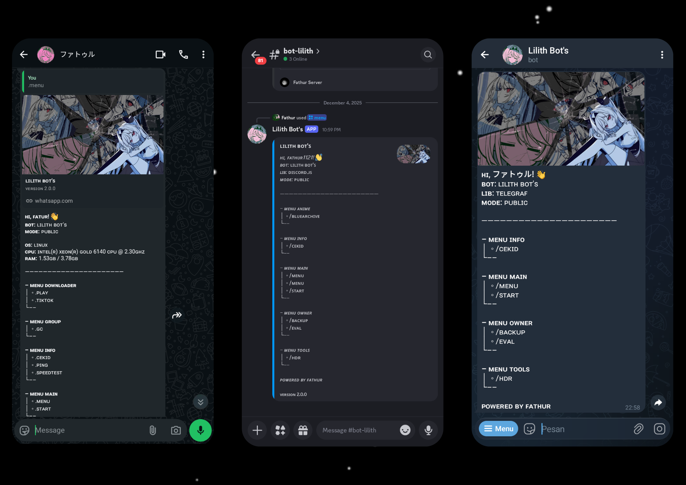

# 🌌 Ryo Bot's (Multi-Platform)

<div align="center">
  
  <br/><br/>
  
  [](https://nodejs.org/)
  [](https://github.com/WhiskeySockets/Baileys)
  [](https://telegraf.js.org/)
  [](https://discord.js.org/)
  
  <p align="center">
    <strong>Satu Bot, Tiga Alam Semesta.</strong><br>
    WhatsApp • Telegram • Discord
  </p>
</div>

---

## 📑 Tentang Project

**Ryo Bot's** adalah bot modular canggih yang dibangun di atas Node.js. Proyek ini memungkinkan Anda menjalankan satu _core_ bot yang terhubung secara simultan ke tiga platform chatting terbesar.

Dilengkapi dengan **AiDev** (Asisten Coding berbasis Gemini AI), **Media Downloader**, dan sistem **Plugin Hot-Reload** yang memungkinkan Anda menambah fitur tanpa perlu me-restart bot.

## ✨ Fitur Unggulan

| Fitur                       | Deskripsi                                                                                                | Platform |
| :-------------------------- | :------------------------------------------------------------------------------------------------------- | :------: |
| 🧠 **AiDev Assistant**      | Asisten coding & chat pintar berbasis **Google Gemini 2.0 Flash**. Memiliki memori percakapan (Session). | ✅ Semua |
| 📥 **Universal Downloader** | Download video **TikTok** (No WM), YouTube, dan platform lainnya dengan cepat.                           | ✅ Semua |
| 🖼️ **Image Tools**          | HD/Upscale gambar, Fake Story Generator, dan manipulasi gambar lainnya.                                  | ✅ Semua |
| 🔌 **Modular System**       | Tambah fitur cukup dengan membuat file `.js` baru di folder plugins.                                     | ⚙️ Core  |
| 🔄 **Hot-Reload**           | Update script plugin secara _real-time_ tanpa restart server.                                            | ⚙️ Core  |

---

## 🛠️ Prasyarat

Sebelum memulai, pastikan Anda telah menginstal:

- [Node.js](https://nodejs.org/en/download/) (Versi 20 atau lebih baru)
- [FFmpeg](https://ffmpeg.org/download.html) (Untuk manipulasi media video/audio)
- Git
- Javascript & NodeJS basic skill
  > DON'T BE AN IDIOT

---

## 🚀 Instalasi & Penggunaan

1.  **Clone Repository**

    ```bash
    git clone https://github.com/alfavz/Ryo-Bot-s.git
    cd Ryo-Bot-s
    ```

2.  **Instal Dependensi**

    ```bash
    npm install
    ```

3.  **Siapkan Konfigurasi**

    ```bash
    npm run setup-config
    ```

4.  **Jalankan Bot**

    ```bash
    npm start
    ```

    > **Catatan untuk WhatsApp:** > Saat pertama kali dijalankan, kode pairing akan muncul di terminal. Masukkan kode tersebut di menu _Linked Devices_ WhatsApp Anda.

---

## 📂 Struktur Project

    ```javascript
    global.config = {
      // --- PLATFORM SWITCH ---
      enableTelegram: true, // Set false jika tidak dipakai
      enableDiscord: true,
      enableWhatsApp: true,

      // --- API KEYS & TOKENS ---
      telegramToken: "TOKEN_TELEGRAM_ANDA",
      discordToken: "TOKEN_DISCORD_ANDA",
      discordClientId: "CLIENT_ID_DISCORD_ANDA", // Wajib untuk Slash Commands

      // --- GEMINI AI (Wajib untuk fitur AiDev) ---
      geminikey: "AIzaSy...", // Ambil di aistudio.google.com

      // --- OWNER INFO ---
      ownerWhatsapp: "628xxx", // Format internasional tanpa +
      ownerTelegram: "ID_TELEGRAM",
      ownerDiscord: "ID_DISCORD",

      botName: "Ryo Bot",
    };
    ```

4.  **Jalankan Bot**

    ```bash
    npm start
    ```

    > **Catatan untuk WhatsApp:** > Saat pertama kali dijalankan, kode pairing akan muncul di terminal. Masukkan kode tersebut di menu _Linked Devices_ WhatsApp Anda.

---

## 📂 Struktur Project

Struktur folder dirancang agar rapi dan mudah dikembangkan:

```
ryo-bot/
├── bot/
│   ├── lib/              # Library inti (Handler, Logger, Baileys Helper)
│   ├── plugins/          # TEMPAT FITUR ANDA BERADA
│   │   ├── discord/      # Plugin khusus Discord
│   │   ├── telegram/     # Plugin khusus Telegram
│   │   └── whatsapp/     # Plugin khusus WhatsApp
│   ├── sessions/         # Penyimpanan sesi login (WA/Tele)
│   ├── config.js         # Konfigurasi utama
│   └── index.js          # Main entry point
└── package.json
```

---

## 🧩 Cara Membuat Plugin

Sistem plugin Ryo Bot sangat fleksibel. Berikut adalah contoh cara membuat fitur sederhana.

<details>
<summary><b>🟢 Klik untuk melihat contoh Plugin WhatsApp</b></summary>

Buat file baru di `bot/plugins/whatsapp/contoh.js`:

```javascript
let handler = async (m, { conn, args }) => {
  // Logika anda di sini
  m.reply("Halo! Ini adalah plugin buatan saya.");
};

handler.command = ["halo", "hi"]; // Command pemicu
handler.tags = ["main"]; // Kategori di menu
handler.help = ["halo"]; // Deskripsi di menu

module.exports = handler;
```

</details>

<details>
<summary><b>🔵 Klik untuk melihat contoh Plugin Telegram</b></summary>

Buat file baru di `bot/plugins/telegram/contoh.js`:

```javascript
let handler = async (ctx) => {
  ctx.reply("Halo dari Telegram!");
};

handler.command = ["halo"];
handler.tags = ["main"];
handler.help = ["halo"];

module.exports = handler;
```

</details>

<details>
<summary><b>🟣 Klik untuk melihat contoh Plugin Discord</b></summary>

Buat file baru di `bot/plugins/discord/contoh.js`. Script ini mendukung **Slash Command** (`/halo`) dan **Prefix** (`.halo`) sekaligus!

```javascript
let handler = async (msgOrCtx, args) => {
  // Auto-detect apakah Slash Command atau Pesan Biasa
  msgOrCtx.reply("Halo dari Discord!");
};

handler.command = ["halo"];
handler.description = "Menyapa bot"; // Wajib untuk Slash Command
handler.tags = ["main"];

module.exports = handler;
```

</details>

---

## 🤝 Kontribusi & Credits

Dibuat dengan ❤️ oleh **Fathur** (FlowFalcon) dan **Fareza**.
Terima kasih kepada komunitas open-source untuk library luar biasa:

- [Baileys](https://github.com/WhiskeySockets/Baileys)
- [Telegraf](https://telegraf.js.org)
- [Discord.js](https://discord.js.org)

---

> **Note:** Gunakan bot ini dengan bijak. Penyalahgunaan fitur (spamming, dsb) dapat menyebabkan akun Anda diblokir oleh pihak platform terkait.
